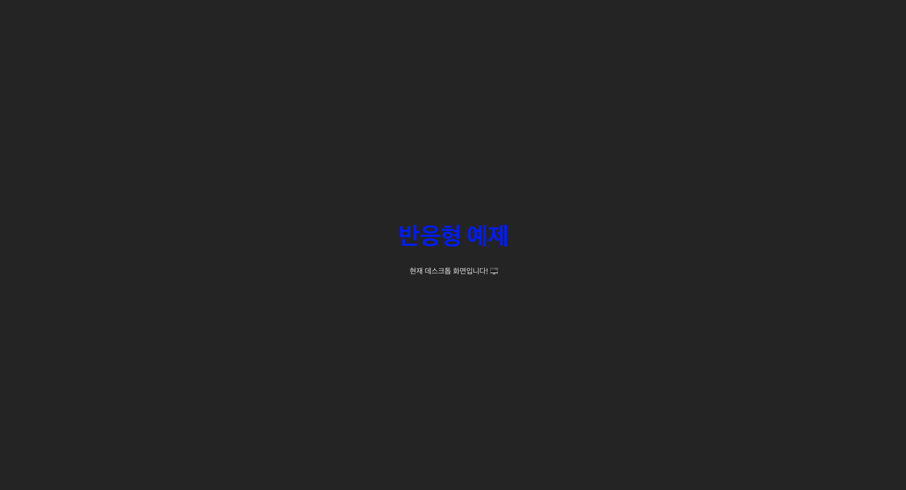
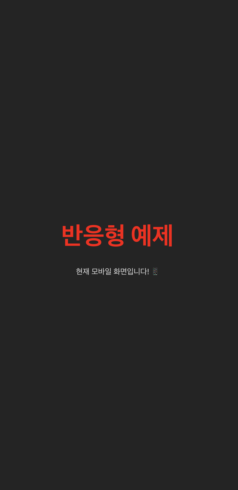

# React Responsive Template 🌐

A responsive React template built with **Vite** for fast and efficient development. This template includes a custom hook for detecting mobile devices using media queries and provides a scalable structure for building responsive web applications.
**Vite**로 빠르고 효율적인 개발을 위해 만들어진 반응형 **React** 템플릿입니다. 이 템플릿은 **미디어 쿼리**를 사용하여 모바일 디바이스를 감지하는 **커스텀 훅**과 확장 가능한 구조를 제공합니다.

<p align="center">
  
  
</p>

## Features / 주요 기능 🚀

- **Vite** for fast development and hot module replacement (HMR)
- **TypeScript** support
- **Mobile detection** using custom hooks (`useIsMobile`)
- **Responsive design** using `MediaQueryContext`
- **Context API** for managing global state
- **Lightweight** and ready for customization
  <br/>
- 빠른 개발 및 HMR(Hot Module Replacement)을 위한 **Vite**
- **TypeScript** 지원
- **useIsMobile** 커스텀 훅을 통한 모바일 감지
- **MediaQueryContext**를 활용한 반응형 디자인
- 전역 상태 관리를 위한 **Context API**
- 가벼운 템플릿으로 쉽게 커스터마이징 가능

## Getting Started / 시작하기 💻

### 1. Clone the repository

```bash
git clone https://github.com/itsjh1242/react-responsive-template.git
cd react-responsive-template
```

### 2. Install dependencies / 패키지 설치

```bash
npm install
```

### 3. Run the development server / 개발 서버 실행

```bash
npm run dev
```

This will start the development server and you can view the app in your browser at http://localhost:3000.

개발 서버가 실행되며, 브라우저에서 http://localhost:3000 주소로 앱을 확인할 수 있습니다.

## Project Structure / 프로젝트 구조 📂

```php
react-responsive-template/
├── src/
│   ├── context/          # Context providers for global state management
│   ├── hook/             # Custom hooks including useIsMobile
│   ├── components/       # Reusable components like Layout
│   ├── App.tsx           # Main entry point of the app
├── public/               # Static assets
├── index.html            # Entry HTML file
├── vite.config.ts        # Vite configuration
└── package.json          # Project dependencies
```

## Technologies Used / 사용된 기술 🛠️

- React + TypeScript

- Vite: For blazing fast builds and development (빠른 빌드와 개발을 위한 Vite)

- Tailwind CSS: For easy and efficient styling (효율적인 스타일링을 위한 Tailwind CSS (적용 시))

- Context API: For managing state globally (전역 상태 관리를 위한 Context API)

- Custom Hooks: For detecting mobile devices using media queries (미디어 쿼리를 통한 모바일 디바이스 감지를 위한 커스텀 훅)

## License / 라이선스 📜

This project is licensed under the MIT License.

이 프로젝트는 MIT License 하에 라이선스가 부여되었습니다.
